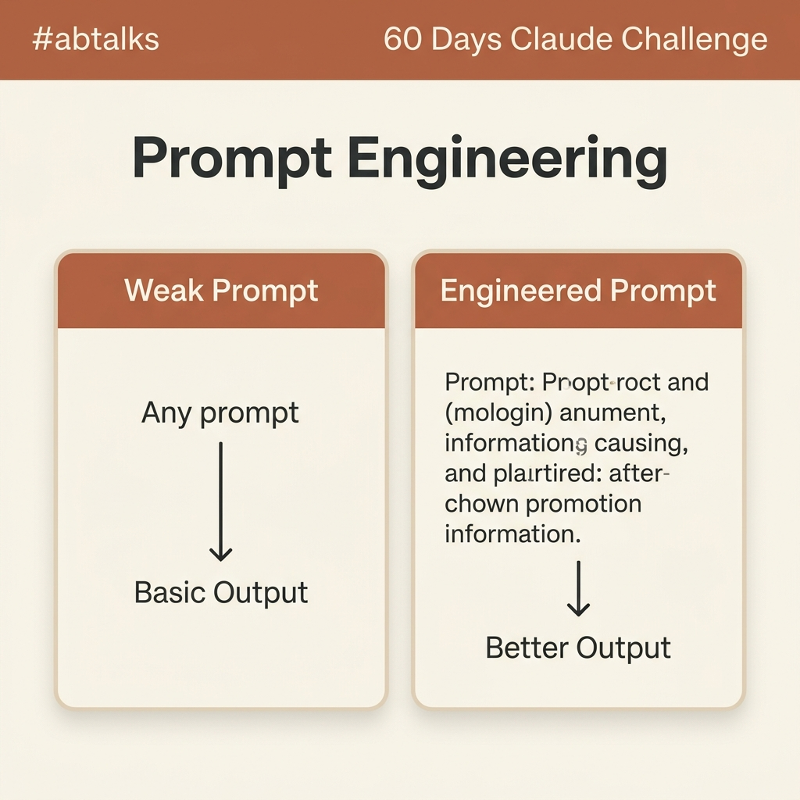

# Day 03: Prompt Engineering & Text is Data (Preprocessing)

> **Challenge:** #abtalks 60 Days AI Challenge  
> **Topics:** Prompt Engineering Fundamentals & NLP Preprocessing Pipeline  
> **Author:** Cyril Christopher J.  

---

## 🎨 Part 1: Prompt Engineering Guide

### Visual Overview



---

### Section 1: Explanation

#### What is Prompt Engineering?
Imagine **Claude** as a brilliant executive assistant who just joined your team. They have incredible knowledge and work at lightning speed, but they can't read your mind!

**Prompt Engineering** is simply the art and skill of giving clear, specific, and well-structured instructions (called "prompts") to AI models. 

It’s the difference between asking a barista for *"a coffee"* versus asking for *"a double-shot oat milk latte, extra hot, with no sugar."* The clearer your request, the closer the final result will match what you actually need.

---

#### Why Prompt Engineering Matters When Using Claude
AI models like Claude are **context-driven engines**:
* **Vague inputs lead to vague outputs:** If you ask a generic question, Claude has to guess your target audience, tone, depth, and desired format.
* **Structured inputs unlock brilliance:** When you provide context, specify a persona, define constraints, and describe your desired output format, Claude uses its advanced reasoning to produce precise, nuanced, and publish-ready content on the first try.

---

#### 3 Practical Benefits of Writing Better Prompts

1. ⏱️ **Saves Massive Time & Eliminates Endless Back-and-Forth**  
   Instead of spending 20 minutes re-prompting or manually editing a bland response, a well-engineered prompt gets you an accurate answer right away.

2. 🎯 **Delivers Highly Tailored & Relevant Content**  
   By specifying your target audience, tone of voice, or industry context, the AI creates responses that fit your brand or exact situation perfectly.

3. 🧠 **Unlocks Advanced AI Capabilities & Workflows**  
   Good prompting enables Claude to perform complex tasks—such as acting as a specialized industry consultant, analyzing complex data, or breaking down multi-step problems step-by-step.

---

### Section 2: Weak vs Improved Prompt Example

#### ❌ Weak Prompt
> **"Write a blog post about time management."**

* **Why it's weak:** It lacks context, audience definition, desired tone, word count, structural formatting, or specific focus areas.
* **Result (Basic Output):** A surface-level, 300-word post filled with generic advice like *"Make a to-do list"* and *"Avoid distractions."*

---

#### ✅ Improved (Engineered) Prompt
> **"Act as an expert productivity coach for remote software engineers. Write a 500-word engaging blog post on practical time management strategies to prevent meeting fatigue. Use an encouraging, professional tone. Include 3 actionable tips with catchy subheadings, and conclude with a 2-sentence call-to-action encouraging readers to block focus time."**

* **Why it's improved:** 
  - **Persona:** *"expert productivity coach"*
  - **Target Audience:** *"remote software engineers"*
  - **Specific Topic:** *"time management strategies to prevent meeting fatigue"*
  - **Format & Structure:** *"500-word blog post, 3 tips with catchy subheadings"*
  - **Tone:** *"encouraging, professional"*
  - **Constraint:** *"conclude with a 2-sentence call-to-action"*
* **Result (Better Output):** A highly focused, tailored, and engaging article directly addressing remote developer pain points with actionable advice ready to share.

---

### Section 3: Detailed Image Generation Prompt

```text
A professional, minimal, square (1080x1080) educational graphic for a LinkedIn post.

Top Header Bar: "#abtalks 60 Days Claude Challenge" written in clean typography.
Main Center Title: "Prompt Engineering" in bold dark charcoal lettering.

Color Palette: 
Anthropic Claude-inspired warm terracotta brown, soft sand beige background, rich cream content cards, and deep espresso typography.

Visual Layout & Content:
- A clean, modern infographic aesthetic with two visual comparison cards placed side-by-side.
- Left Card (Labeled "Weak Prompt"): Warm brown top banner with cream body. Shows a simple input box with an arrow pointing down to a box labeled "Basic Output".
- Right Card (Labeled "Engineered Prompt"): Terracotta brown top banner with cream body. Shows a detailed structured prompt block with input parameters, with an arrow pointing down to a polished card labeled "Better Output".

Style & Aesthetics: Minimalist vector typography, modern productivity and AI visual theme, clean geometric alignment, premium aesthetic suitable for a professional LinkedIn post.
```

---

## 🔤 Part 2: Text is Data — Turning Words into Numbers

> **Context**: Machines don't read words. They read numbers. Preprocessing is the first transformation that turns raw human language into something a model can learn from.
> 
> **Real-World Impact**: Every NLP system — search, chatbots, classification — starts with tokenization and preprocessing. Get this wrong and the rest of the pipeline collapses.

### 📋 Overview of Deliverables

1. 📓 **Jupyter Notebook**: [`Day3_Text_is_Data.ipynb`](./Day3_Text_is_Data.ipynb)
   - Step-by-step demonstration of tokenization (NLTK vs spaCy), stop word/punctuation removal, and Bag-of-Words vectorization with Seaborn heatmaps.
2. 📊 **Preprocessed ML Dataset**: [`preprocessed_dataset.csv`](./preprocessed_dataset.csv)
   - Tabular dataset containing raw text, token counts, JSON token streams, cleaned text, and $N \times V$ Bag-of-Words feature matrix.
3. 🐍 **Python Pipeline Script**: [`day3_preprocessing.py`](./day3_preprocessing.py)
   - Standalone Python module to run the preprocessing pipeline.

---

### 🔍 Key Preprocessing Pipeline Steps

#### 1. Tokenization (NLTK & spaCy)
Continuous text is broken down into discrete sentences and word tokens.
- **Sentence Tokenization**: `nltk.sent_tokenize` & `spacy.doc.sents`
- **Word Tokenization**: `nltk.word_tokenize` & `spacy.doc`

#### 2. Stop Words & Punctuation Filtering
Common low-value words (*is, the, and, in*) and punctuation marks (*., !, -, ?*) are stripped out, significantly reducing vocabulary dimensionality:

| Document | Raw Tokens | Cleaned Tokens | Removed Tokens | Dimensionality Reduction |
| :--- | :---: | :---: | :---: | :---: |
| **Doc 1** | 28 | 15 | 13 | **46.4%** |
| **Doc 2** | 30 | 17 | 13 | **43.3%** |
| **Doc 3** | 30 | 12 | 18 | **60.0%** |
| **Doc 4** | 17 | 13 | 4 | **23.5%** |

#### 3. Bag-of-Words (BoW) Representation
Cleaned text tokens are converted into numerical term-frequency vectors using `scikit-learn` `CountVectorizer`:
- **Vocabulary Size**: 50 unique terms
- **Matrix Dimension**: $4 \times 50$ document-term matrix ready for ML classification algorithms (Logistic Regression, Naive Bayes, etc.)
