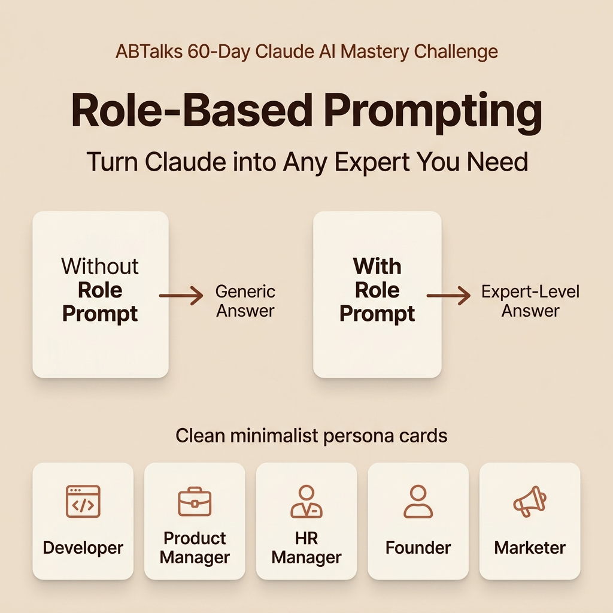

# Day 04: Role-Based Prompting — Turn Claude into Any Expert You Need

> **Challenge:** #abtalks 60-Day Claude AI Mastery Challenge  
> **Topic:** Role-Based Prompting Fundamentals & Persona Activation  
> **Skill Level:** Beginner (35 min)  
> **Author:** Cyril Christopher J.  

---

## 🎨 Visual Overview: LinkedIn Post Graphic



---

## 📚 Section 1: Beginner-Friendly Explanation

### What is Role-Based Prompting?
Imagine walking into a massive library filled with millions of experts: software engineers, legal advisors, marketing strategists, and financial analysts. 

If you walk up to the front desk and ask, *"How should I launch a product?"*, the receptionist will give you a generic, high-level summary that applies to almost anything. 

However, if you walk straight to a **Senior Product Marketing Manager** and ask the exact same question, you'll get a precise, step-by-step strategy tailored to go-to-market channels, customer acquisition costs, and launch timelines.

**Role-Based Prompting** is the practice of explicitly instructing an AI model like Claude to adopt a specific **persona, professional identity, or domain expertise** before it answers your question. By setting a role (e.g., *"Act as a Senior Python Developer"* or *"You are an empathetic HR Director"*), you prime the AI to filter its vast knowledge base through that specific professional lens.

---

### Why Role-Based Prompting Matters in Claude
Large Language Models like **Claude** are trained on billions of parameters covering thousands of disciplines. By default, when you ask a broad question, Claude defaults to a neutral, average, and generalized response to be safe and broad.

When you assign a role:
1. **Knowledge Activation**: You activate specific semantic clusters and specialized domain vocabulary inside Claude's reasoning model.
2. **Contextual Filtering**: Claude automatically filters out irrelevant advice and focuses exclusively on industry-standard frameworks, rules, and best practices.
3. **Perspective Alignment**: Claude adopts the specific goals, constraints, and mental models of that persona (e.g., a Founder focuses on ROI and speed, while an HR Manager focuses on compliance and employee well-being).

---

### How Assigning a Role Changes Response Quality

Assigning a role fundamentally transforms AI output across four key dimensions:

| Output Dimension | Without Role Prompt (Default AI) | With Role Prompt (Persona Activated) |
| :--- | :--- | :--- |
| **Perspective** | Generic, surface-level overview | Specialized practitioner insight |
| **Vocabulary & Tone** | Academic, plain, repetitive | Industry jargon, professional, authentic |
| **Depth & Nuance** | Basic bullet points | Detailed frameworks, edge cases, trade-offs |
| **Actionability** | Vague advice ("Plan well") | Step-by-step execution roadmap with metrics |

---

### 🚀 3 Practical Benefits of Role-Based Prompting

#### 1. 🎯 Instant Domain Expertise Without Hiring Consultants
You get immediate access to top-tier advisory frameworks across engineering, legal, marketing, and strategy without needing specialized degrees or expensive consultations.

#### 2. ⚡ Eliminates Follow-Up Prompts & Saves Time
Because the role prompt sets the tone, depth, and expectations upfront, Claude delivers publish-ready, highly tailored content on the first try rather than requiring 4–5 revision prompts.

#### 3. 🛡️ Enables Critical Thinking & Counter-Perspective Analysis
You can ask Claude to act as a **"skeptical venture capitalist"** or **"strict security auditor"** to stress-test your business pitch or code architecture before sharing it with real stakeholders.

---

## 🔍 Section 2: Real-World Example Comparison

### ❌ Example 1: Without a Role Prompt

#### Prompt:
> *"How do I give feedback to a team member who is missing deadlines?"*

#### Default AI Response (Generic Answer):
> Giving feedback to a team member who is missing deadlines requires clear communication:
> 1. Schedule a private meeting with them.
> 2. Explain which deadlines were missed.
> 3. Ask them why they are struggling.
> 4. Set clear expectations for future tasks.
> 5. Follow up regularly to track progress.
> 
> *Analysis:* While technically correct, this advice is generic, lacks empathy frameworks, doesn't address underlying burnout or workload issues, and offers no specific conversation scripts.

---

### ✅ Example 2: With a Role Prompt

#### Prompt:
> *"You are an experienced HR Manager and empathetic leadership coach. How do I give constructive feedback to a senior software engineer who has missed two major sprint deadlines recently due to potential burnout? Provide a step-by-step 1-on-1 meeting framework, script opening lines, and follow-up support actions."*

#### Role-Based AI Response (Expert-Level Answer):
> **Role Context Activated:** *HR Manager & Leadership Coach*
> 
> Here is an empathetic, performance-focused framework tailored for your 1-on-1 with the senior engineer:
> 
> ### 1. Pre-Meeting Mindset & Preparation
> - Focus on **outcomes and support**, not punishment.
> - Review recent pull request velocity and meeting load to identify systemic bottlenecks before assuming poor effort.
> 
> ### 2. Meeting Structure & Scripting
> * **Warm Opening (Psychological Safety):**  
>   *"Thanks for making time to chat today. First off, I want to say how much I value your technical leadership on the team. I’ve noticed the last two sprint releases were delayed, which is unusual for you. I wanted to check in—how are you feeling about your current workload and velocity?"*
> * **Root-Cause Exploration:**  
>   Ask open questions: *"Are context-switching or unplanned production tickets blocking your focus time?"*
> * **Collaborative Action Plan:**  
>   Offer immediate relief: *"Let's defer non-critical refactoring tasks for next sprint and protect 4 hours of uninterrupted focus time daily."*
> 
> ### 3. Follow-Up & HR Documentation
> - Send a supportive summary email confirming agreed support measures.
> - Schedule a 2-week check-in to assess stress levels and progress.
> 
> *Analysis:* The response is structured, actionable, highly empathetic, includes exact meeting scripts, and accounts for psychological safety and HR best practices.

---

## 🎴 Section 3: The Persona Prompt Library

Here are 5 ready-to-use persona prompt templates for key roles:

### 1. 💻 Developer Persona
```text
You are a Principal Software Architect specializing in TypeScript, Node.js, and scalable cloud systems. 
Review the following code snippet for performance bottlenecks, security vulnerabilities, and adherence to clean code principles. Provide refactored code with explanations.
```

### 2. 📊 Product Manager Persona
```text
You are a Senior Product Manager at a fast-growing B2B SaaS company. 
Help me draft a PRD (Product Requirements Document) for a new real-time team collaboration feature. Include target user personas, key user stories, success metrics (KPIs), and potential risks.
```

### 3. 👥 HR Manager Persona
```text
You are an HR Director with expertise in remote team culture, conflict resolution, and labor compliance. 
Draft a compassionate yet clear remote-work policy update regarding flexible core hours and asynchronous communication expectations.
```

### 4. 🚀 Founder / Executive Persona
```text
You are a seasoned Tech Startup Founder and Venture Partner. 
Critique this elevator pitch for a seed-stage AI startup. Identify weak value propositions, potential investor objections, and suggest 3 ways to sharpen our unit economics story.
```

### 5. 📢 Marketer Persona
```text
You are a Growth Marketing Strategist specializing in organic LinkedIn content and developer relations. 
Transform this technical product feature announcement into an engaging 5-hook LinkedIn post series designed to drive signups.
```

---

## 🎨 Section 4: Image Concept & Prompt Details

### Design Specifications:
* **Dimensions:** 1080×1080 (1:1 Aspect Ratio for LinkedIn Post)
* **Color Palette:** Warm Anthropic Claude aesthetic
  - Background: Soft Sand Beige (`#F5EFE6`)
  - Accent Banners: Terracotta Brown (`#D97757`)
  - Content Cards: Warm Cream (`#FBF7EE` / `#FFFFFF`)
  - Typography: Deep Espresso Charcoal (`#2C221E`)
* **Key Visual Elements:**
  - Top Branding Header: `ABTalks 60-Day Claude AI Mastery Challenge`
  - Hero Title: `Role-Based Prompting`
  - Subtitle: `Turn Claude into Any Expert You Need`
  - Central Comparison Flow: `Without Role Prompt → Generic Answer` vs `With Role Prompt → Expert-Level Answer`
  - Persona Icons & Cards: Developer, Product Manager, HR Manager, Founder, Marketer

---

## 🔗 Deliverable & Repository Tracking

* **GitHub Repository:** [60-days-of-ai](https://github.com/cyrilchrisj/60-days-of-ai)
* **Day 04 Folder:** [`/Day-04`](./README.md)
* **Visual Asset:** [`role-based-prompting.png`](./role-based-prompting.png)
